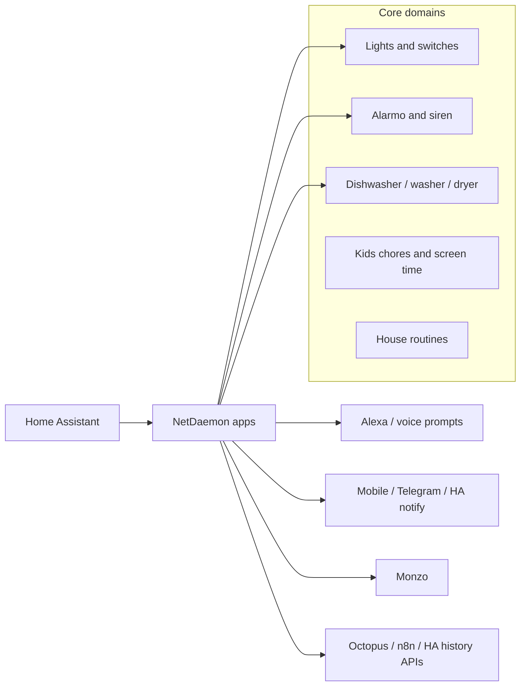
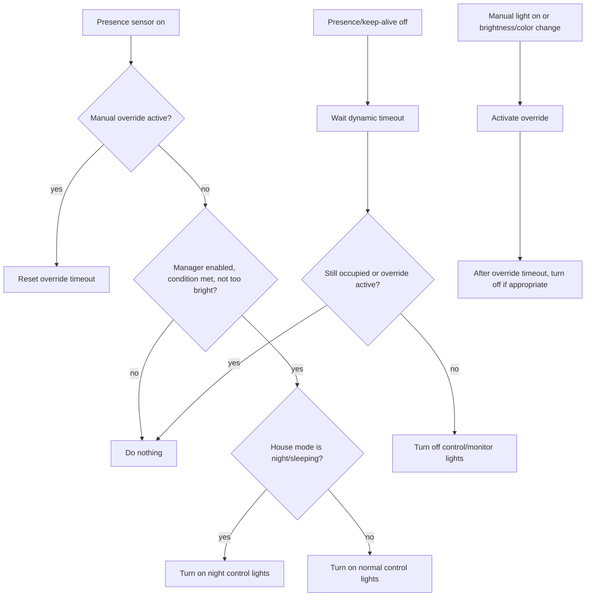
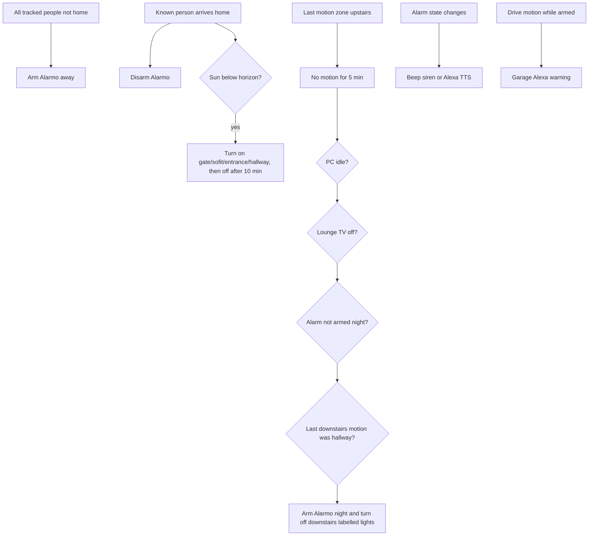
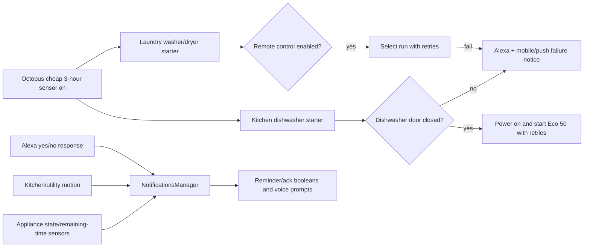
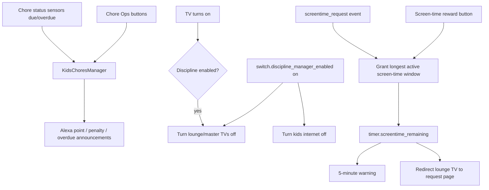

# Apps and Automations

This repository contains NetDaemon apps that automate Home Assistant entities for lighting, security, household routines, appliance reminders, energy-aware appliance starting, kids chores, screen time, and several integrations.

The notes below are based on the code under `apps/`. Secret values and tokens present in source files are intentionally not repeated here.

## High-level map

## Active NetDaemon apps

| Area | App | What it does |
| --- | --- | --- |
| Alarm clock | `AlarmClock` | Watches `input_boolean.alarm_clock_enabled` and `input_datetime.alarm_clock_time`. When enabled, schedules weekday Alexa wake-up announcements on the configured alarm-clock media players, but only if master-bedroom motion suggests nobody has already moved since the alarm time. |
| General automations | `Automations` | Currently mostly dormant. Contains a disabled kids-out-of-bed detector that would combine Aaron motion followed by master motion and raise `kids_out_of_bed_event`. |
| Batteries | `BatteriesApp` | Twice daily, scans Wiser TRV battery sensors. Sends mobile notification and Alexa announcements for flat batteries at `0` and low batteries at `<= 5`. |
| Debugging | `DebugState` | Optional state logger controlled by `DebugState.yaml`. When enabled, writes selected entity state changes to daily JSONL files. It is disabled in config. |
| Dining | `DiningApp` | On `input_button.diningseating`, announces whose turn it is to sit next to mummy based on day-of-week rotation. |
| Discipline | `DisciplineManager` | Creates and maintains `switch.discipline_manager_enabled`. When enabled, turns off lounge/master TVs and kids internet, blocks TV reactivation, and announces discipline timer changes for Jayden, Aaron, and Gabriel. Also registers an `increment_timer` service callback. |
| Chores | `KidsChoresManager` | Integrates with Chore Ops helper entities for Jayden, Aaron, and Gabriel. Announces chore approvals, bonus points, penalties, point adjustments, and overdue chore status batches across upstairs/downstairs Alexa groups. |
| Screen time | `ScreenTime` | Gates lounge-TV browser use through a screen-time request page. Chore reward buttons grant timed screen time, start `timer.screentime_remaining`, warn 5 minutes before expiry, and redirect back to the request page when time expires. |
| Energy | `AgileRatesApp` | Creates `sensor.all_rates_new`, fetches Octopus Agile rates, stores the current/future rates as sensor attributes, and refreshes every 30 minutes. |
| Energy | `EnergyApp` | Announces and notifies when configured Octopus cheapest 3-hour energy target binary sensors turn on. Some older cheapest-window calculation code is retained but commented. |
| Health | `HealthApp` | Logs warnings/errors when entities become unavailable, the smart meter HAN leaves `joined`, the postbox becomes unavailable, or Wiser TRV battery sensors become unavailable. |
| History | `HistoryReader` | Experimental HA history reader for `light.kitchen`; currently fetches history but does not write output because file writing is commented. Also defines history DTOs used by other apps. |
| Internet | `InternetApp` | Placeholder for Pi-hole enforcement. Its enforcement code is commented out. |
| Bedroom light | `JaydenLight` | Turns Jayden floor light on at 1 percent warm white on Jayden motion, then turns it off after 30 minutes without motion. |
| Kids chores legacy | `KidsChores` | Legacy chore/TV enforcement. Every 5 minutes, if lounge TV is on and kids have overdue chores, sends a TV notification and turns the TV off after a short delay. Also announces morning-routine chore counts from `input_button.chore_status`. |
| Kitchen | `Kitchen` | Starts dishwasher automatically when a cheap-energy window begins and `input_boolean.dishwasher_reminder` is on. Checks door state, retries Eco 50 program start, sends voice/push/mobile failure notices, and handles coffee-machine ready/light behavior. |
| Laundry | `Laundry` | Schedules washer and tumble dryer to start when a cheap-energy window begins if their remote-control binary sensors are enabled. Announces scheduling/cancellation and pushes failure alerts after retries. |
| Lights | `LightsManager` / `Manager` | Config-driven room light manager. Creates `switch.light_manager_<room>` controls, reacts to motion/keep-alive entities, lux limits, house mode, manual overrides, watchdog timers, night-light sets, and periodic reset. |
| Monzo | `MonzoApp` / `MonzoClient` | Handles Monzo OAuth callback events, refreshes tokens, checks balance, and replenishes the main account from a Bills pot when below threshold. Sends push notification if the Bills pot is too low. |
| Motion alerts | `MotionAlerts` | Config-driven motion notifications for selected sensors, mainly night-time/armed contexts. Notifies Eugene when watched motion sensors trigger and someone may care. |
| Appliance notifications | `NotificationsManager` | Builds dishwasher, washer, and dryer notification handlers. Announces remaining time, prompts when appliances are finished/unloaded, processes Alexa prompt responses, and updates reminder/acknowledge booleans. |
| Postbox | `Postbox` | Uses `AlexaPromptPoller` to remember postbox activity, then prompts on hallway motion: "Have you collected it?" Yes acknowledges the stateful trigger; no reminds again after cooldown. |
| Office | `Office` | Creates `binary_sensor.eugene_desktop_active`, marks it on/off from desktop activity, brightens office light while active, and schedules PC sleep after inactivity/unoccupied checks. AC door-open logic is present but commented. |
| Presence / house | `Routines` | Handles media-player volume when house mode changes, disarms alarm when known people arrive home, turns on arrival lights at night, arms away when everyone leaves, and disarms night alarm on hallway/stairs motion. |
| Morning summary | `SummaryRoutine` | Triggers n8n morning/evening summary webhooks by input buttons and weekday schedules, announces returned summary plus the joke sensor, and sends Twinstead notification. |
| Morning kids | `MorningKids` | Weekday school-run voice countdown at 07:00, 07:15, 07:30, 07:35, 07:40, and 07:45. Contains an unused LED countdown frame builder for an ESPHome RGBW strip. |
| Jayden tablet | `JaydenTablet` | Prompts Jayden about taking a tablet when kitchen/utility/back-door activity occurs and `input_boolean.jayden_tablet` is off. A yes response sets the boolean; no/non-yes responses remind. Resets daily. |
| House mode prompts | `HouseModePrompts` | Prompts to switch to day mode after morning kitchen/utility activity and sun above horizon. Prompts to switch to night mode after master motion and sun below horizon. Sends periodic silent healthcheck prompts. |
| Security | `Security` | Handles alarm state notifications, alarm failure callback, triggered alarm push alert, siren beeps on door/alarm events, driveway motion warning when armed, simulated lights while armed, and automatic night arming when motion/PC/TV conditions align. |
| Vacation | `VacationApp` | Creates vacation mode switch and next-state sensor. When enabled, disables adaptive lighting, replays last week's configured light history for today, and schedules matching on/off actions. |
| Test | `TestApp` | Scratch/test app with examples for history calls, Alexa prompts, prompt responses, and secret/environment logging. No active behavior because all body logic is commented. |

## Lighting flow

`LightsManager.yaml` defines the rooms and their presence sensors, lights, lux limits, night-mode lights, timeouts, and random-state metadata. `LightsManager` instantiates one `Manager` per room.

Configured rooms currently include Study, Dining, Landing, Porch, Backdoor, Drive, Aaron, Jayden, Hallway, Entrance, Master, SittingRoom, Lounge, and Kitchen. Some room configs are commented out.

## Security and house mode

## Appliance and cheap-energy flow

## Chores, discipline, and screen time

## Notification systems

There are two notification stacks under `apps/`:

| Folder | Role |
| --- | --- |
| `NotificationManager` | Older routine engine. `NotificationManager` starts `MorningRoutine`, `EveningRoutine`, `TestRoutine`, and `KidsOutOfBed` from input buttons/events. `RoutineManager` steps through announcements and Alexa prompts using a Stateless state machine. Some daemon-style notification producers are prototypes or disconnected from an active app. |
| `NotificationsManager` | Newer appliance/postbox notification app. `NotificationsManager` handles dishwasher/washer/dryer cycle prompts and responses. `Postbox` uses `AlexaPromptPoller` for stateful mail reminders. |

## Config files

| File | Purpose |
| --- | --- |
| `apps/AlexaConfig.yaml` | Person and device config for helper-based Alexa notification behavior, including known Alexa person IDs and default day/night volume behavior. |
| `apps/DebugState/DebugState.yaml` | Enables/disables state dumping and lists entities to trace. Currently disabled. |
| `apps/Kitchen/Kitchen.yaml` | Configures coffee-machine power sensor, light, and adaptive-lighting switch. |
| `apps/LightsManager/LightsManager.yaml` | Main room automation config for light managers. |
| `apps/MotionAlerts/MotionAlerts.yaml` | Selects motion sensors watched by `MotionAlerts`. |
| `apps/VacationApp/VacationApp.yaml` | Lists lights replayed by vacation mode. |
| `apps/VoiceTimer/VoiceTimer.yaml` | Legacy NetDaemon app config for the commented-out voice timer. |

## Support and prototype code

| Code | Status / use |
| --- | --- |
| `Duolingo` and `DuolingoResponse` | Disabled app plus DTOs for Duolingo API responses. The app logs in to configured users and deserializes profile data, but `[NetDaemonApp]` is commented. |
| `EntityManger/EntityManager.cs` | Entirely commented prototype for MQTT entity creation/debug state. |
| `LightsManager/RandomManager.cs` | Entirely commented older/random light simulation manager. Random-state config remains in YAML but this class is not active. |
| `Lounge/LoungeApp.cs` | Entirely commented experiments for TV idle detection, game-console exclusions, and pipeline nodes. |
| `Security/DoorWatchdog.cs` | Entirely commented standalone door watchdog service. Similar logic exists partly inside `Security` but is disabled there too. |
| `NotificationsManager/BatteryNotifications.cs` | Commented mobile-device battery enforcement/reminder app. |
| `NotificationManager/NotificationEngineApp.cs` | Commented prototype for merging daemon notification streams. |
| `NotificationManager/Daemons/*` | Mixed prototype daemon producers. `Calendar`, `Producer1`, and `Producer2` are concrete classes but are not wired into an active `[NetDaemonApp]`; several others are commented. |
| `VoiceTimer/VoiceTimer.cs` | Commented legacy NetDaemonRxApp countdown timer. |
| `Routines/Trains.cs`, `TrainDetails.cs`, `NullableDateTimeConverter.cs` | Helper code for formatting train sensor attributes as markdown. The subscriptions in `Routines` are currently commented. |
| `Energy/ExtMethods.cs` | Helper extension for finding cheapest energy windows from a sorted rate dictionary. Current consuming code is commented in `EnergyApp`. |

## Operational notes

- Several apps create MQTT-backed Home Assistant helper entities dynamically, including light-manager switches, vacation mode helpers, discipline manager switch, and `binary_sensor.eugene_desktop_active`.
- A number of automations depend on generated Home Assistant entities in `HomeAssistantGenerated.cs`, especially strongly typed `IEntities` accessors.
- The code contains embedded API credentials/tokens in a few integration prototypes. Keep them out of documentation and consider moving them to secrets/config before sharing the repo.
- `[Focus]` appears on `MonzoApp`, which may affect NetDaemon app loading depending on the runtime configuration.
